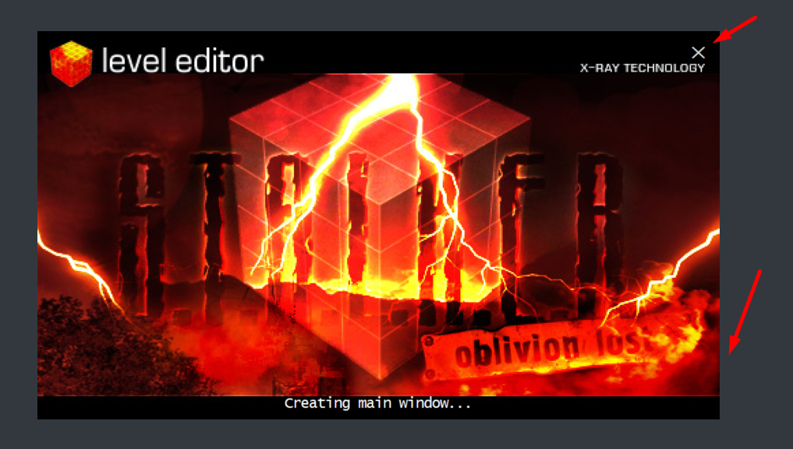
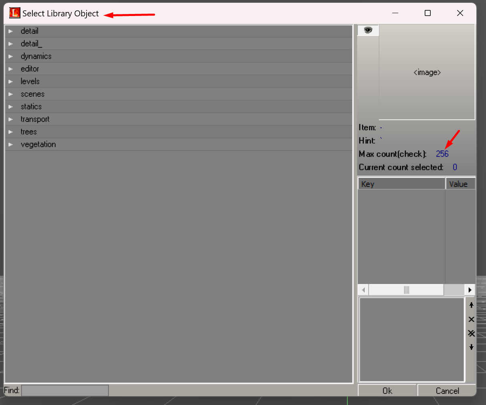
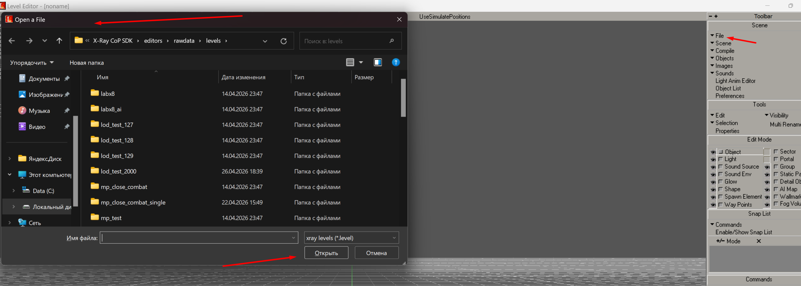
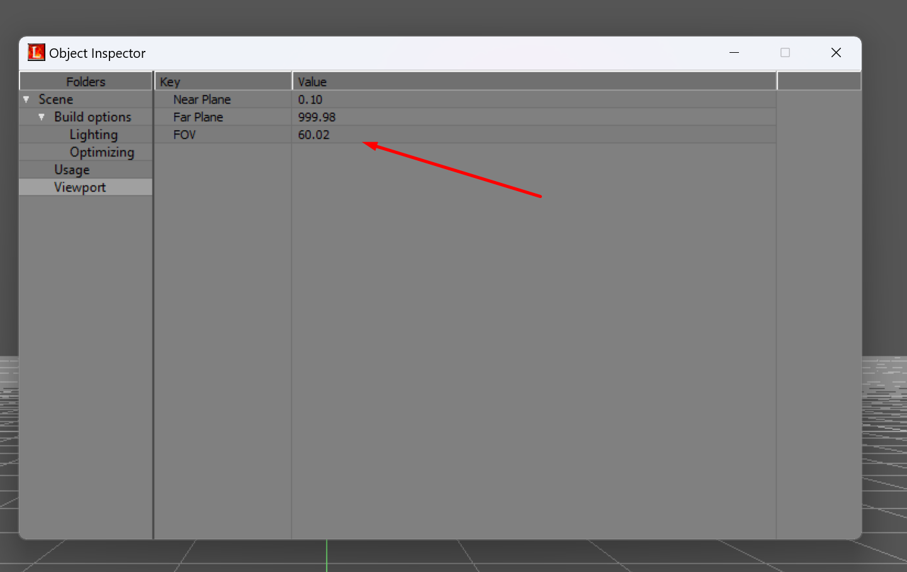
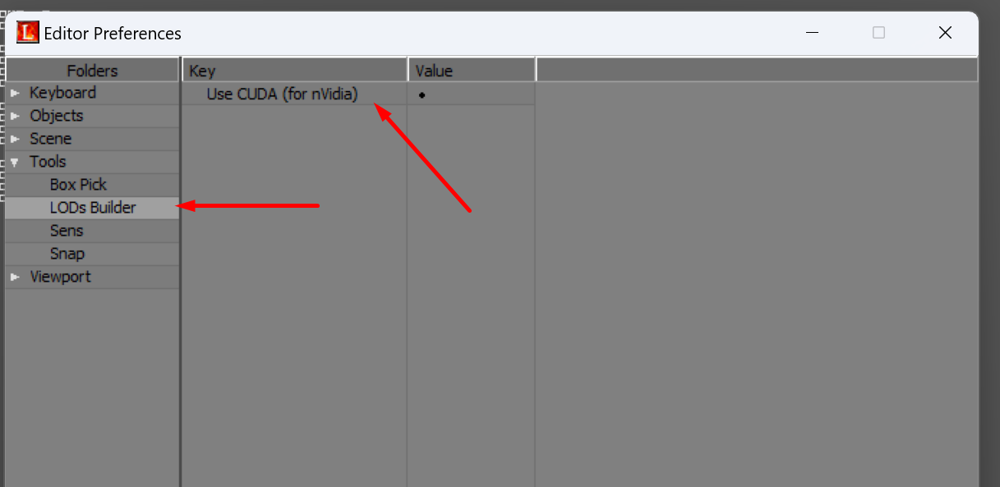
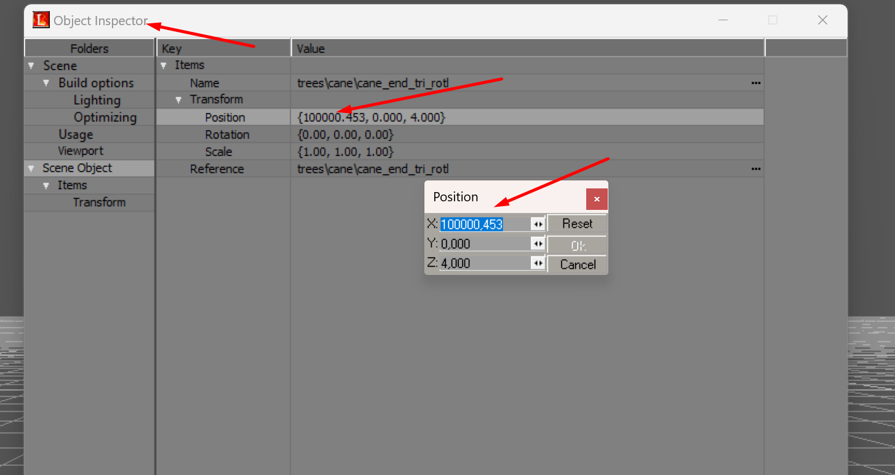
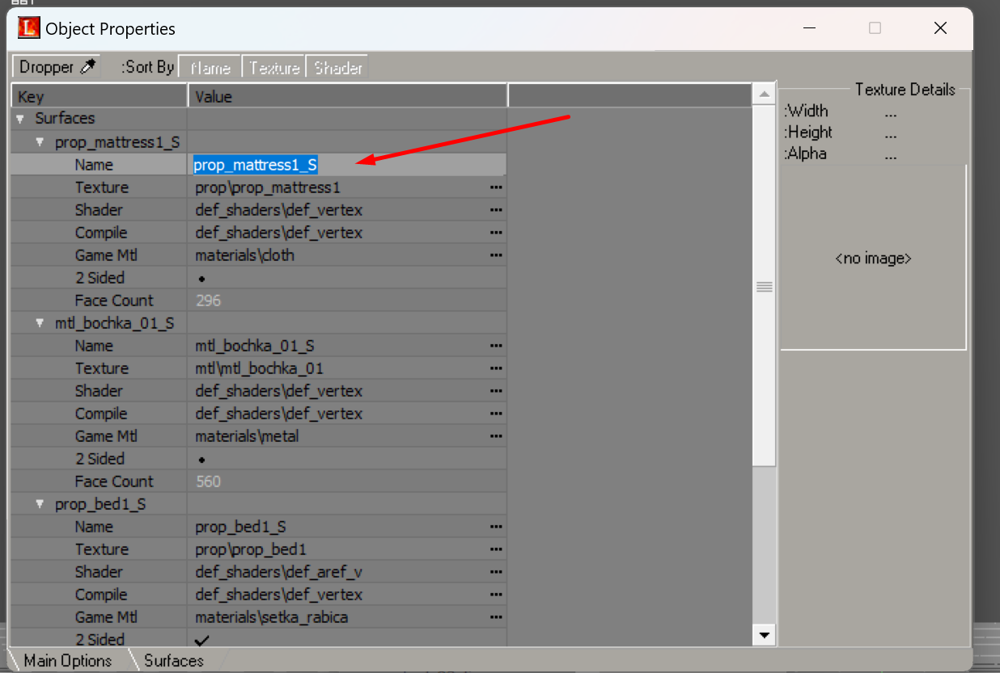
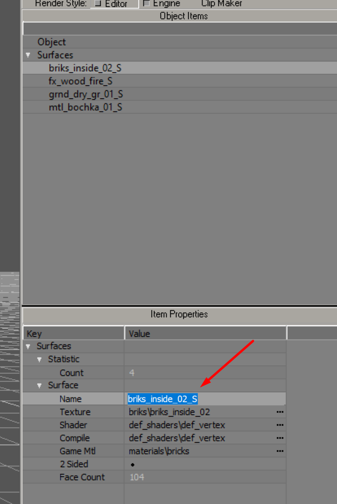
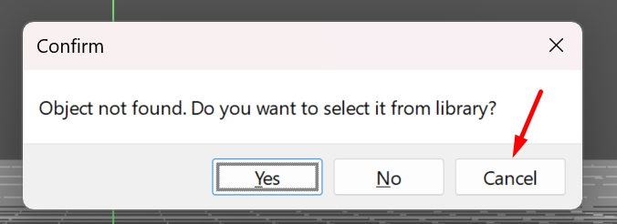

# Галерея скриншотов

**Неблокирующий splash - screen для AE и LE, а также возможность прервать загрузку:**

**Вывод максимального количества объектов для сессии Multiple Append Objects:**

**Замена диалоговых окон на COM - реализацию:**

**Вывод настроек камеры по клавише enter в LE:**

**Вывод активации билдинга LOD - текстуры в LE с помощью CUDA (если поддерживается):**

**Возможность указания координат объектов в LE до xxxxxx.xxx:**

**Переименование материалов у активного объекта в Library Editor в LE:**

**Переименование материалов у активного объекта в AE:**

**При загрузке карты и отсутствии spawn/object - моделей есть кнопка, которая прерывает загрузку уровня в LE:**

